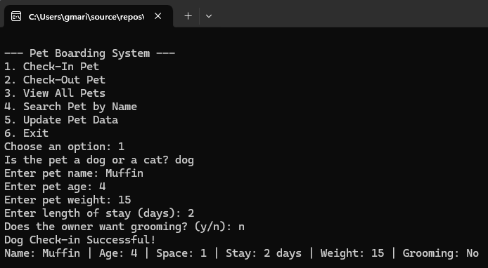
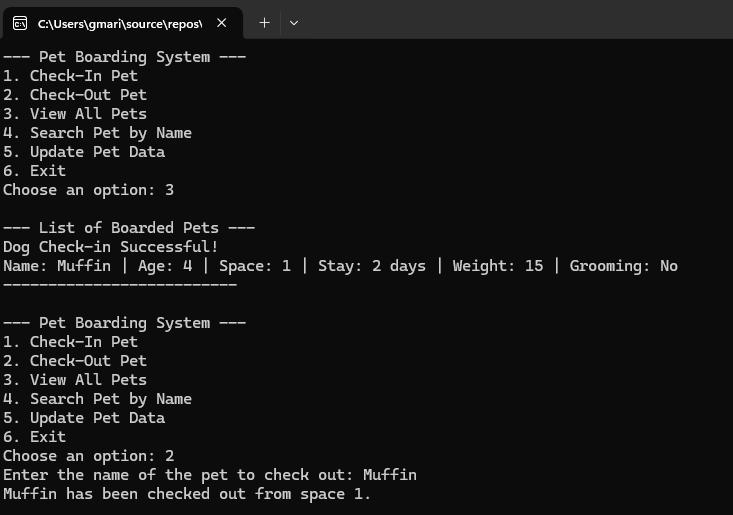

## Gonzales' ePortfolio  

  

**A Little Something about me**

Welcome to my ePortfolio! My name is **Maridelle Anne Gonzales**, and I’m in my early 20s. I am currently graduating as a **Computer Science major at Southern New Hampshire University**. During my free time, I enjoy **playing games and watching series**. I also have a dog named **Oreo**, whom I’ve had since I was 17 years old.  

I’m originally from the **Philippines**, but I grew up in the **USA**. Interestingly, I first studied **Civil Engineering** for two years at **De La Salle University** in the Philippines, but eventually realized that my true passion lies in **Computer Science**. As a tech enthusiast, I enjoy exploring programming, software development, and system design.  

If given the chance, I would also like to focus on **game development**. Although it’s not the main focus of my Computer Science program, I once took a game development elective, and it fascinated me to learn how games are designed and created. This ePortfolio showcases my learning journey, projects, and enhancements in software design, algorithms and data structures, and databases, highlighting my skills and career aspirations.

---  

## Professional Self-Assessment  

Over the course of my program, I have developed a well-rounded foundation in software design and engineering, algorithms and data structures, databases, and security. Completing my coursework and developing this ePortfolio has allowed me to showcase my strengths, highlight my technical skills, and prepare to enter the professional field of computer science.

Throughout the program, I have gained hands-on experience with software development and programming through courses like Foundation in Application Development, Mobile Architecture and Programming, and Full Stack Development I. For instance, my mobile application project in Android Studio demonstrated object-oriented programming concepts such as encapsulation, inheritance, and polymorphism. Enhancements I implemented including UI/UX improvements, security checks, and input validation, reflect my growth in professional coding practices and attention to usability, accessibility, and data protection. These skills have prepared me to collaborate effectively in team environments, communicate technical solutions to stakeholders, and produce software that is functional, efficient, and secure.

In the area of algorithms and data structures, my work in DSA Analysis and Design and Software Development Lifecycle courses allowed me to implement complex problem-solving strategies, optimize algorithms, and efficiently manage data structures. For example, in a course management system project, I used topological sorting and graph structures to visualize prerequisites, demonstrating my ability to design robust and logical systems. These experiences have strengthened my analytical thinking and reinforced my ability to solve complex programming challenges.

My expertise in databases was enhanced through Introduction to Structured Database Environments and Client/Server Development courses. I learned to construct structured environments, manipulate data, and create efficient queries, while integrating database operations with object-oriented applications. Additionally, I applied these skills in my pet check-in/check-out system, implementing search, update, and reporting functionalities that reflect real-world application and logical design. These experiences highlight my ability to combine software development with data management—a skill highly valued in both enterprise and full-stack development roles.

Security has been another focus area through courses like Software Security and Secure Coding, where I gained expertise in secure coding practices, encryption technologies, and vulnerability mitigation. These skills are critical in ensuring software integrity and protecting user data, especially in today’s environment where cybersecurity is a top priority.

I have also explored areas that align with my long-term passion for game development through courses like Info Tech and Digital Games and Design of Virtual Game Environments. These courses introduced me to game mechanics, AI integration, user interface design, and interactive environments, giving me insight into how software and systems are applied in creative and engaging ways.

Throughout this program, I have consistently demonstrated growth in problem-solving, programming, system design, database management, and security, all while applying critical thinking, communication, and teamwork skills across academic and technical contexts. By presenting these artifacts and experiences cohesively in my ePortfolio, I aim to provide prospective employers with a clear view of my technical expertise, analytical thinking, and professional readiness.

This ePortfolio not only summarizes my accomplishments but also serves as a foundation for future opportunities in software development, full-stack and mobile applications, and game design, reflecting my technical skills, creativity, and commitment to professional growth. I am confident that the combination of hands-on technical experience, interdisciplinary learning, and focus on emerging technologies positions me as a well-prepared candidate for a career in computer science.

--- 

## Code Review Link

This code review provides an overview of the original artifact before enhancements. It walks through the existing functionality, highlights areas for improvement, and explains the planned modifications. The review also demonstrates how I approached analyzing structure, efficiency, and security to prepare for enhancements that align with professional standards and course outcomes.

[Watch it here!](https://youtu.be/D8y4Yv6BfL8)

---

## Enhancement One: Software Design and Engineering

**Artifact:** Final mobile application developed in Android Studio.  

**Original Skills Demonstrated:**  
- User-centered design  
- Object-oriented programming (encapsulation, inheritance, polymorphism)  
- Frontend-backend integration  

**Enhancements:**  
- Improved UI/UX design for accessibility and usability  
- Added error handling and input validation  
- Implemented security checks for user authentication and data handling  
- Documented code and design decisions

[Original Code](https://github.com/MaridelleG/MaridelleG.github.io/tree/main/artifact1/original_code) | [Enhanced Code](https://github.com/MaridelleG/MaridelleG.github.io/tree/main/artifact1/enhanced_code)   

| Screenshot of the Application | Screenshot of the Application |
|--------------|--------------|
|  |  |  

**Narrative:**  

This section presents my narrative for the Software Design and Engineering artifact, a mobile application developed in Android Studio. Here, I describe the original project, the enhancements I implemented to improve usability, maintainability, and security, and reflect on the skills and course outcomes demonstrated through this work.  

[Artifact 1 Narrative](https://github.com/MaridelleG/MaridelleG.github.io/blob/main/artifact1/Artifact%201%20Narrative)

## Enhancement Two: Algorithms and Data Sctructure  

**Artifact:** Course management system implemented in C++ using unordered_map and vector.  

**Original Skills Demonstrated:**  
- Use of hash tables for efficient data access
- Implementation of sorting algorithms and structured data handling
- File I/O and processing of tab-separated course data

**Enhancements:**  
- Added topological sorting to manage course prerequisites
- Implemented graph data structures to visualize dependencies
- Included unit tests to validate correctness of algorithms
- Optimized memory usage and enhanced error handling

[Original Code](https://github.com/MaridelleG/MaridelleG.github.io/tree/main/artifact2/original_code) | [Enhanced Code](https://github.com/MaridelleG/MaridelleG.github.io/tree/main/artifact2/enhanced_code)

| Screenshot of the Application | Screenshot of the Application |
|--------------|--------------|
|  |  |  

**Narrative:** 

This section presents my narrative for the Algorithms and Data Structures artifact, a course management system built in C++. I describe the original project, the enhancements I implemented to improve efficiency, correctness, and visualization of dependencies, and reflect on the skills and course outcomes demonstrated through this work.  

[Artifact 2 Narrative](https://github.com/MaridelleG/MaridelleG.github.io/blob/main/artifact2/Artifact%202%20Narrative)  

## Enhancement Three: Databases

**Artifact:** Pet Check-In/Check-Out pseudocode and flowchart. 

**Original Skills Demonstrated:**  
- Object-oriented design applied to data modeling
- Logical structuring of data and operations for pet management
- Application of encapsulation, inheritance, abstraction, and polymorphism

**Enhancements:**  
- Integrated file-based database operations with object-oriented design.
- Added search functionality for pets by name.
- Added update functionality to modify pet data
- Added reporting to view all currently boarded pets.
- Linked OOP concepts to database-like operations  

[Original Code](https://github.com/MaridelleG/MaridelleG.github.io/blob/main/artifact3/OriginalCodeDocument.docx) | [Enhanced Code](https://github.com/MaridelleG/MaridelleG.github.io/tree/main/artifact3/enhanced_code)

| Screenshot of the Application | Screenshot of the Application |
|--------------|--------------|
|  |  |  

**Narrative:** 

This section presents my narrative for the Databases artifact, a pet check-in/check-out system. I describe the original pseudocode and flowchart, the enhancements I implemented to create a functional database system with search and reporting capabilities, and reflect on the skills and course outcomes demonstrated through this work.

[Artifact 3 Narrative](https://github.com/MaridelleG/MaridelleG.github.io/blob/main/artifact3/Artifact%203%20Narrative)

