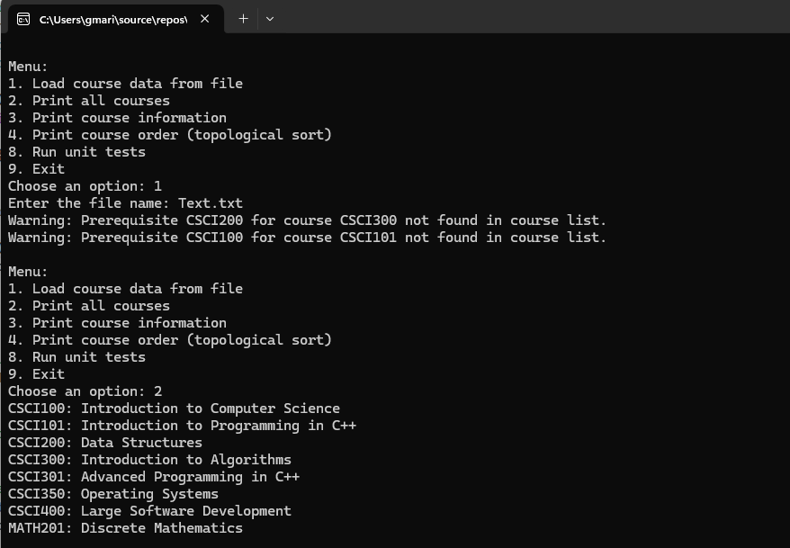
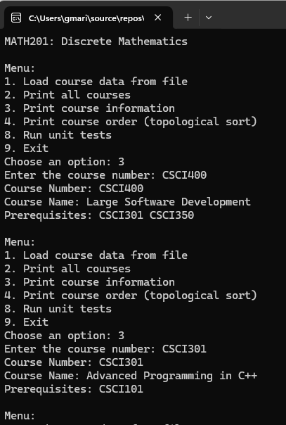

## Welcome to My ePortfolio

Hello. My name is Maridelle Gonzales, and this site is a showcase of my Computer Science capstone. Enjoy!

---

## Code Review Link

This code review provides an overview of the original artifact before enhancements. It walks through the existing functionality, highlights areas for improvement, and explains the planned modifications. The review also demonstrates how I approached analyzing structure, efficiency, and security to prepare for enhancements that align with professional standards and course outcomes.

[Watch it here!](https://youtu.be/D8y4Yv6BfL8)

---

## Enhancement One: Software Design and Engineering

**Artifact:** Final mobile application developed in Android Studio.  

**Original Skills Demonstrated:**  
- User-centered design  
- Object-oriented programming (encapsulation, inheritance, polymorphism)  
- Frontend-backend integration  

**Enhancements:**  
- Improved UI/UX design for accessibility and usability  
- Added error handling and input validation  
- Implemented security checks for user authentication and data handling  
- Documented code and design decisions

[Original Code](https://github.com/MaridelleG/MaridelleG.github.io/tree/main/artifact1/original_code) | [Enhanced Code](https://github.com/MaridelleG/MaridelleG.github.io/tree/main/artifact1/enhanced_code)   

| Screenshot of the Application | Screenshot of the Application |
|--------------|--------------|
|  |  |  

**Narrative:**  

This section presents my narrative for the Software Design and Engineering artifact, a mobile application developed in Android Studio. Here, I describe the original project, the enhancements I implemented to improve usability, maintainability, and security, and reflect on the skills and course outcomes demonstrated through this work.  

[Artifact 1](https://github.com/MaridelleG/MaridelleG.github.io/blob/main/artifact1/Artifact%201%20Narrative)

## Enhancement Two: Algorithms and Data Sctructure  

**Artifact:** Course management system implemented in C++ using unordered_map and vector.  

**Original Skills Demonstrated:**  
- Use of hash tables for efficient data access
- Implementation of sorting algorithms and structured data handling
- File I/O and processing of tab-separated course data

**Enhancements:**  
- Added topological sorting to manage course prerequisites
- Implemented graph data structures to visualize dependencies
- Included unit tests to validate correctness of algorithms
- Optimized memory usage and enhanced error handling

[Original Code](https://github.com/MaridelleG/MaridelleG.github.io/tree/main/artifact2/original_code) | [Enhanced Code](https://github.com/MaridelleG/MaridelleG.github.io/tree/main/artifact2/enhanced_code)

| Screenshot of the Application | Screenshot of the Application |
|--------------|--------------|
|  |  |  

**Narrative:** 

This section presents my narrative for the Algorithms and Data Structures artifact, a course management system built in C++. I describe the original project, the enhancements I implemented to improve efficiency, correctness, and visualization of dependencies, and reflect on the skills and course outcomes demonstrated through this work.  

[Artifact 2](https://github.com/MaridelleG/MaridelleG.github.io/blob/main/artifact2/Artifact%202%20Narrative)
